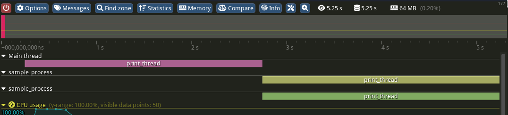

## 01/07

sent message to cipharius for his info, asked if branch up to date
started debug

tool crashes on weird queue type if the capture tool is not present

```
❯ ./build/multiplex/tracy-multiplex
Starting Tracy multiplexer on port 8085
Listening for client UDP broadcast messages...
Connecting to a client:
	Name: sample_process
	ID: 34730334005440
	Address: 192.168.56.73
	Port: 8086
Welcome message:
	timerMul: 0.434029
	initBegin: 93571803818998
	initEnd: 93572363880672
	delay: 170
	resolution: 38
	epoch: 1719859369
	exectime: 1719850425
	pid: 810854
	samplingPeriod: 100000
	flags: 4
	cpuArch: 2
	cpuId: 34540
Connected to client successfuly

Got supposedly weird type 59
tracy-multiplex: /home/gregoire.roussel/dev/perf/tracy/multiplex/src/multiplex.cpp:736: bool handle_client_response(ClientConnection&, const tracy::QueueItem*, uint32_t): Assertion `ev->hdr.idx >= (int)tracy::QueueType::StringData' failed.
[1]    810585 IOT instruction (core dumped)  ./build/multiplex/tracy-multiplex
```

haven't managed to run multiple programs as part of the same trace - capture exits as soon as the first one exits



